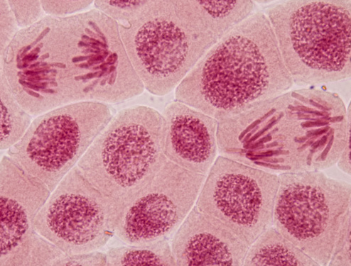
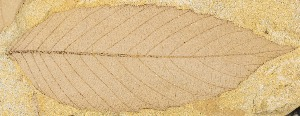
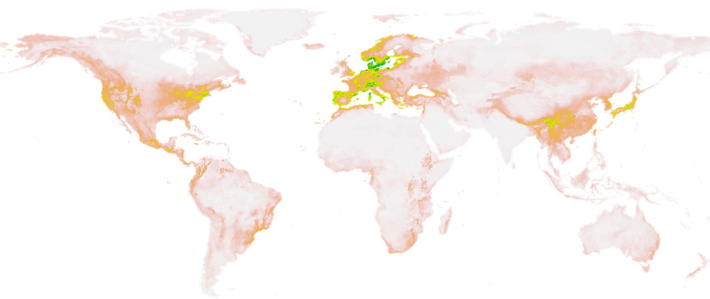

# ABOUT ME
Welcome to my website! I am a macroevolutionary biologist interested in how evolution over millions of years affects the diversification and biogeography of (mainly) plant species. Keep on reading to learn about my research! Or, feel free to check out [my CV](./cv_page.html), my [Google Scholar page](https://scholar.google.com/citations?user=0ewKmH8AAAAJ&hl=en), or my [Twitter profile](https://twitter.com/EricHagen19).

## POLYPLOIDY

Polyploidy is LIT! I wrote a [meta-analysis](https://onlinelibrary.wiley.com/doi/10.1111/oik.09908) about it and I'm working on a biogeography paper that you can see a [pre-print](https://www.biorxiv.org/content/10.1101/2023.09.01.555981v1) of.

## LEAF PALEOBIOLOGY

Love it! This is what I'm working on in my postdoc.

## BIOGEOGRAPHY

In addition to my work on the latitudinal polyploidy gradient, I worked on [this paper](https://nph.onlinelibrary.wiley.com/doi/full/10.1111/nph.18971) on the biogeography of plant life histories.
