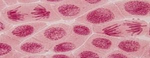
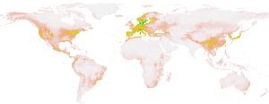

# ABOUT ME
Welcome to my website! I am a macroevolutionary biologist interested in how evolution over millions of years affects the diversification and biogeography of (mainly) plant species. Keep on reading to learn about my research! Or feel free to check out [my CV](./cv_page.html), my [Google Scholar page](https://scholar.google.com/citations?user=0ewKmH8AAAAJ&hl=en), my [Twitter profile](https://twitter.com/EricHagen19), or my [Bluesky profile](https://bsky.app/profile/erichagen.bsky.social).

If you would like access to one of my publications but do not have it, please send me a full-text request on [Researchgate](https://www.researchgate.net/profile/Eric-Hagen).

## POLYPLOIDY

Polyploid plants, which possess more than two copies of their genomes, frequently possess traits that distinguish them from their diploid progenitors, sometimes to striking degrees. I have conducted research on several aspects of polyploidy, including its relationship to plant-pathogen interactions and range evolution, across many clades of flowering plants, attempting to understand the effects of polyploidy (or lack thereof) in phylogenetic context. Recently, I published a [meta-analysis](https://onlinelibrary.wiley.com/doi/10.1111/oik.09908) that investigates whether diploid and polyploid plants differ in their ability to resist pathogens, as well as a paper that attempts to discern the causes of the [latitudinal polyploidy gradient](https://bsapubs.onlinelibrary.wiley.com/doi/full/10.1002/ajb2.16356).

## LEAF PALEOBIOLOGY

My love for leaf fossils started during my undergraduate thesis, in which I developed a method to reconstruct the original areas of fragmented fossil leaves by applying knowledge of how the density of secondary veins scales with leaf area in the leaves of many flowering plants. This method, which you can read about [here](https://pubs.geoscienceworld.org/sepm/palaios/article-abstract/34/1/43/568424/NO-LARGE-BIAS-WITHIN-SPECIES-BETWEEN-THE), is useful for paleobotanists aiming to reconstruct mean annual precipitation from the areas of leaf fossils, which are frequently fragmented. Currently, my postdoctoral research focuses on phenotypic innovation in angiosperm leaves over time. More info forthcoming!

## BIOGEOGRAPHY

In addition to my work on the latitudinal polyploidy gradient, I worked on [this paper](https://nph.onlinelibrary.wiley.com/doi/full/10.1111/nph.18971) on the global distribution of life histories of flowering plants. We found that annual angiosperms exhibit higher rates of climatic niche evolution than perennial ones, and they seem to be favored in environments that frequently experience extreme heat and drought. I personally think the methods in this paper are really cool, so I highly recommend you have a look for yourself!
